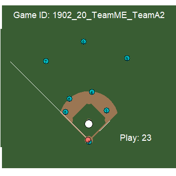
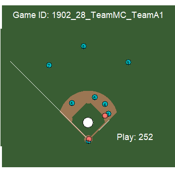
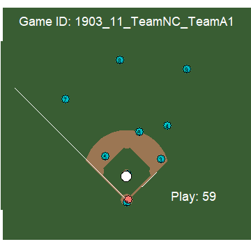
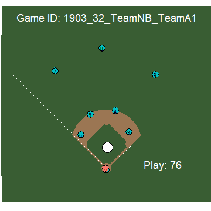
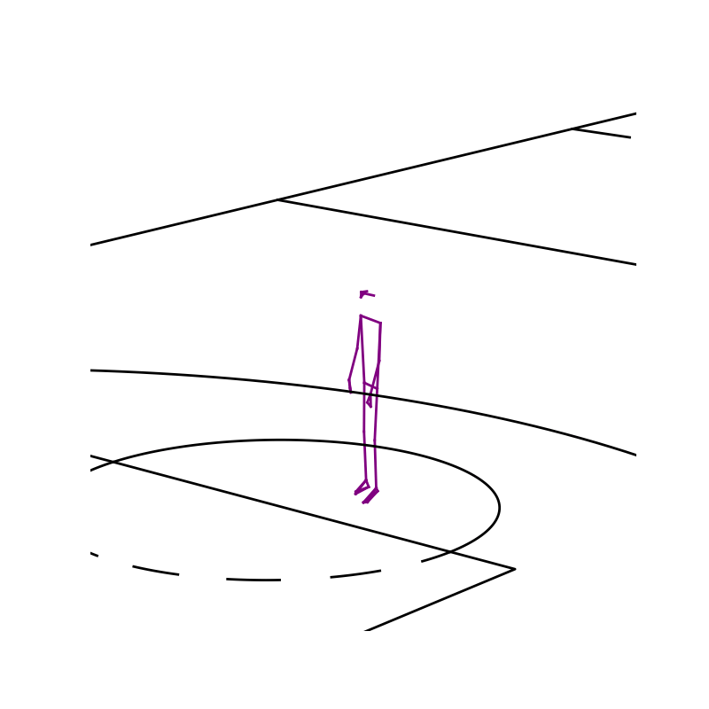

This section overviews my extra-curiculars in sports analytics, where I've learned a lot of engineering skills through projects.

### ⚾ 2023 SMT Data Challenge

My first success story for sports analytics projects came in 2023, for the SMT data challenge. We entered the graduate student category, as one of the four of us was a grad student. Our project focused on evaluating the catchability of balls thrown to first based, to evaluate a first-baseman’s catching ability, since catching throws from other players accounts for the majority of their defensive work. We went on to win the graduate student division with our presentation at Carnegie Mellon and won 2000 USD. We also went to a Steelers game to celebrate!
[🔗 GitHub Repo](https://github.com/danielhocevar/SMT-Baseball-2023)

```{=html}
<div class="gif-grid">
  <div class="gif-item">
    
    <p> 13% Catch Probability</p>
  </div>
  <div class="gif-item">
    
    <p> 52% Catch Probability</p>
  </div>
  <div class="gif-item">
    
    <p> 74% Catch Probability</p>
  </div>
  <div class="gif-item">
    
    <p> 98% Catch Probability</p>
  </div>
</div>
```

### 🏈 2024 Big Data Bowl
My next success story for sports analytics came through the 2024 Big Data Bowl. I got to work with the winners of the 2023 Big Data Bowl, fellow club members who taught me an immense amount. We also placed 9th at of over 300 submissions, winning 5000 USD. Our project focused on evaluating how players contributed to making tackles without being the player to make the tackle. This allowed for credit assignment in a continuous fashion rather than a binary outcome, creating more discriminatory power for evaluating good defensive play.
[🔗 GitHub Repo](https://github.com/hinayatali9/BigDataBowl2024)

We also worked on improving the interpretability of our model, with updates such as the attention mechanism shown below


### 🏀 2025 SPL x UTSPAN Data Challenge

Riding on our club’s success with our recent projects, we reached out to Devin Pleuler of MLSE. This led to the SPL x UTSPAN data challenge, where students from UTSPAN were given data from MLSE’s sports performance lab’s markerless motion capture system. [🔗 GitHub Repo](https://github.com/mlsedigital/SPL-Open-Data)



### 2025 OUSAC Conference

Building on the breakout of our Club through the SPL data challenge, the next step was to connect students with industry professionals. We did this by hosting a conference at the university of Toronto, with the help of the other major sports analytics clubs in Ontario, also know as OUSAC. With over 90 attendees, and keynotes from MLSE and Blackhawks speakers, this was a big step forward for developing sports analytics in Ontario, as well as connecting our sponsors (TISS, Blue Jays, MLSE) and students.

{ width=600px }

### ? 2025 SPL x UTSPAN Data Challenge ?

Stay Tuned!

### Other Works
For other work I've conducted in the field of sports analytics, please see my section on my analytics course project, focused on GroupWAR, the concept of wins above replacement in the group context.